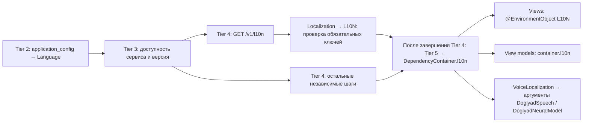

# Локализация приложения

## API и каталоги

`GET /v1/l10n` имеет собственный `router_v1` и обязательную проверку Firebase App Check.
Клиент отправляет `Accept-Language` с `Language.currentCode`. Backend возвращает
только один язык; неподдерживаемый язык разрешается в `application.locale.defaultCode`.
Ответ содержит `Content-Language` и `Vary: Accept-Language`.

```json
{
  "code": "ru",
  "strings": {
    "buttonSpeech": "Заполнить голосом",
    "scanPatientDefaultNameLabel": "Пациент#{count}"
  },
  "voice": {
    "code": "ru",
    "dictation": { "patterns": {}, "numbers": {}, "schema": {} },
    "speech": {}
  }
}
```

Пример выше сокращён. Полный ответ обязателен для инициализации приложения.
Файлы находятся в `config/<environment>/<code>/`:

| Файл | Содержание |
|---|---|
| `l10n.json` | Переводы сущностей backend, системные промпты, названия исследований и шаблоны. Их получают существующие ручки конфигурации. |
| `l10n_application.json` | 276 ключей интерфейса и переводов; ключи соответствуют `L10NKey`. |
| `l10n_voice_parsing.json` | Перенесённый без изменения правил каталог распознавания/разбора: слова чисел, паттерны, единицы, описания схемы, данные корректора речи. |
| `l10n_ultrasound_examination_contextual_strings.json` | Контекстные фразы по ID исследования; их получает ручка типов исследования. |

Каталоги загружаются и проверяются при старте backend и включаются в Docker image.
Переводы для приложения присутствуют в `development` и `production`, для `en` и `ru`.

## Инициализация и использование в iOS



Tier 4 — один `StepSet`, как и остальные уровни инициализации. Загрузка локализации
стоит первой в списке; все асинхронные шаги этого набора запускаются параллельно,
поскольку они не зависят друг от друга. Tier 5 запускается только после завершения
всего Tier 4. При ошибке контейнер не публикуется, показывается локальный экран ошибки.
Повторная инициализация скачивает каталог заново. Постоянного кэша переводов нет.

Модели `Language`, `Localization` и вложенная `VoiceLocalization` находятся в
`ios/Doglyad/Domain/Localization`. `VoiceLocalization` хранит языковые правила разбора
и коррекции речи, а не подписи интерфейса. Они доступны через `container.l10n.voice`;
отдельного геттера в контейнере нет.

`L10N` и его расширения находятся в `ios/Doglyad/Application/Application/L10N`.
Расширение SwiftUI `View` для инъекции каталога находится в `Utility/Extension/View.swift`.
Класс хранит неизменяемый каталог и проверяет все известные enum-ключи один раз.
Дополнительные серверные ключи разрешены для совместимости с более старыми клиентами.
Пропущенные/пустые известные ключи приводят к ошибке инициализации. Локаль создаётся
из `Localization.code`, полученного от backend; отдельного ожидаемого кода нет.

```swift
// На корне иерархии; одновременно задаёт Environment.locale.
view.localization(container.l10n)

// Во вьюхе.
@EnvironmentObject private var l10n: L10N
DText(l10n[.buttonSpeech])
DButton(title: l10n[.buttonDone], action: onConfirm)

// Готовая строка для валидатора, письма или другой модели.
let text = container.l10n.text(.scanPatientDefaultNameLabel, values: ["count": "12"])
// ru: Пациент#12; en: Patient#12.
```

Подстановки используют именованные `{count}`, `{current}`, `{total}` и другие
параметры. Вставленные данные остаются буквальным текстом: `%`, Unicode и фигурные
скобки пациента не исполняются как формат/вложенный шаблон. `{{organ}}` внутри примера
медицинского шаблона также остаётся текстом. `LocalizedStringResource` применяется
только как адаптер к существующим компонентам DoglyadUI; перевод берётся из `L10N`.

## Что остаётся в bundle

В `Localizable.xcstrings` остаются 10 ключей: ошибки отсутствия интернета, недоступного
сервиса, общей ошибки инициализации, экран новой версии и его кнопка обновления.
Они нужны до загрузки `/l10n`. JSON из `Resources/Localization` удалены.

`InfoPlist.xcstrings` обслуживает отдельную системную поверхность: название приложения
и диалоги разрешений iOS. ОС читает установленный bundle, поэтому эти строки остаются
локальными. SDK сторонних библиотек также владеют своими системными интерфейсами.

SwiftUI previews отображают технические имена enum-ключей и используют неактивные
технические паттерны. Переводы/словари для preview не встраиваются в приложение.
Тестовые JSON — символьные ссылки на backend development-каталоги, копируемые только
в `DoglyadTests.xctest`; они не входят в поставляемое приложение.

## Проверки и изменение переводов

Backend проверяет одинаковые ключи, структуру voice-каталогов, типы, массивы чисел,
непустые UI-переводы и одинаковые параметры подстановок для языков. Backend-тесты
также сверяют JSON обоих окружений с Swift enum и свойствами моделей, проверяют
App Check, язык ответа, fallback и отклонение повреждённых каталогов при старте.

Для нового UI-ключа добавьте case в `L10NKey` и переводы во все `l10n_application.json`.
Для изменения voice-схемы синхронно обновите контракт модуля и все серверные каталоги.
Тестовые ссылки автоматически читают обновлённые файлы — второй источник переводов
для тестов не поддерживается.

После проверки обновляйте backend до установки нового клиента: клиенту нужна ручка
`/v1/l10n`. При обновлении текста уже существующего ключа пересборка iOS не требуется;
новый перевод будет получен при следующей инициализации.
