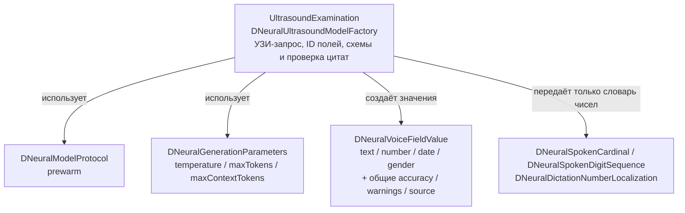
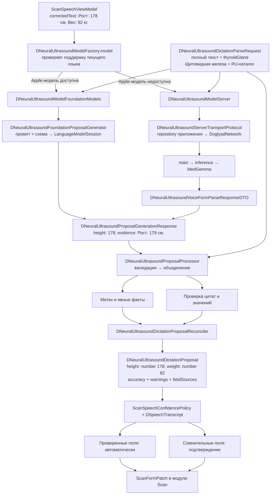
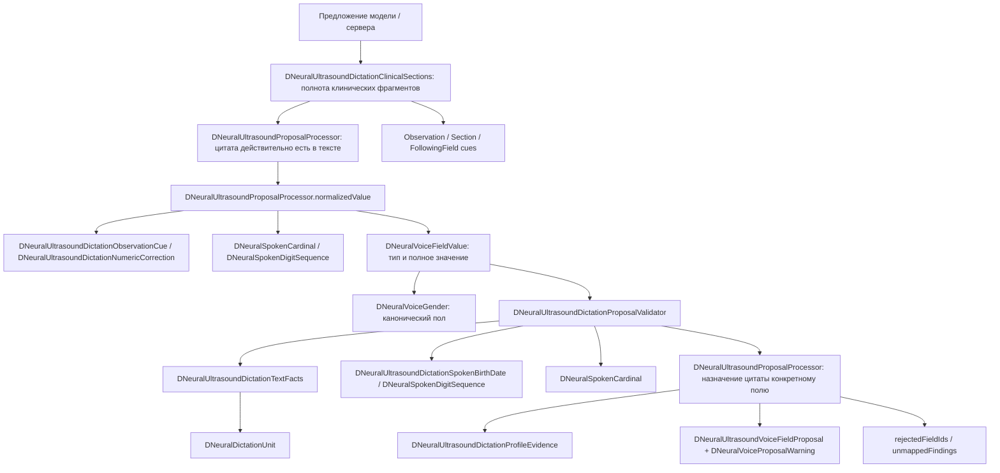
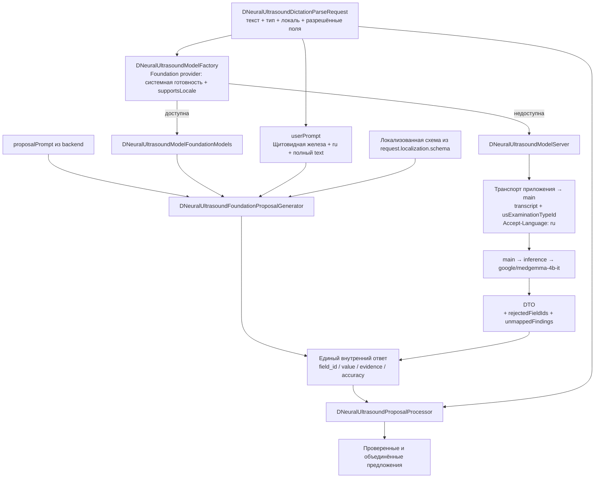
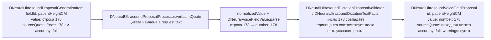
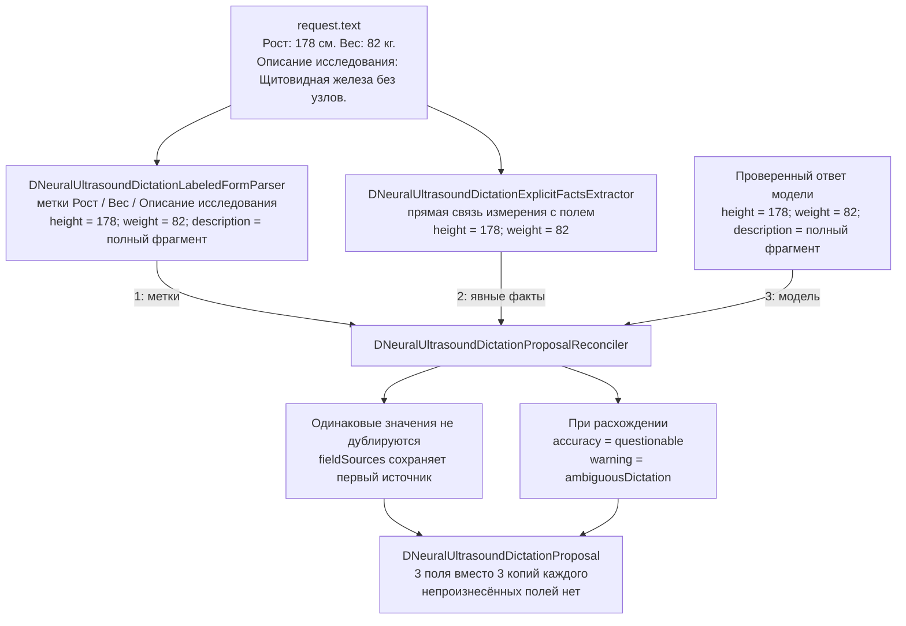
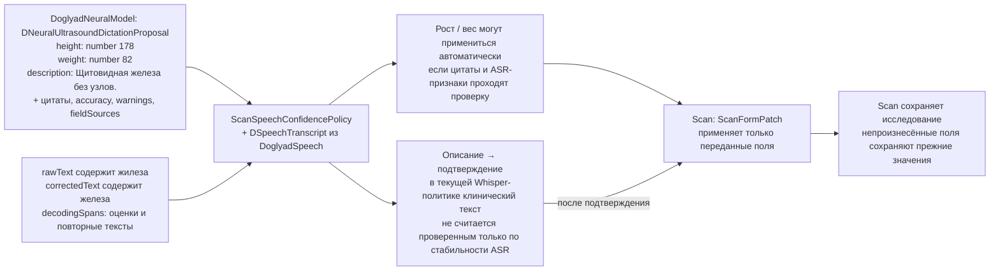
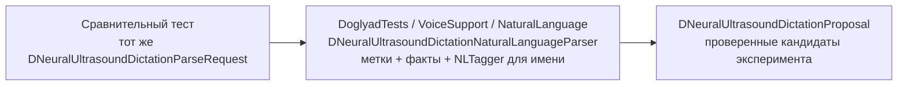

# DoglyadNeuralModel

Модуль содержит общие инструменты работы с нейромоделями и предметные реализации для отдельных направлений. Сейчас реализовано извлечение полей **ультразвукового исследования** из готового текста и проверка значений по диктовке. Запись/ASR, HTTP и сохранение формы находятся в других модулях.

Общие типы имеют префикс `DNeural`; типы УЗИ — `DNeuralUltrasound`. Правило относится также к структурам, enum, протоколам и объявленным вложенным помощникам.

## Структура папок

| Папка | Что находится внутри |
|---|---|
| `Contract/` | Общие значения: текст/число/дата/пол, сторона, точность, предупреждения и источник. Здесь нет ID полей исследования. |
| Корень модуля | Общие `DNeuralGenerationParameters`, `DNeuralModelProtocol` и `DNeuralModelError`: параметры генерации, прогрев и ошибки модели. |
| `Parsing/` | Общие единицы и преобразование произнесённых чисел/цифр. Числовые функции получают только `DNeuralDictationNumberLocalization`. |
| `Localization/` | Общие словари чисел и короткие записи единиц. |
| `UltrasoundExamination/` | `DNeuralUltrasoundModelFactory` — фабрика разбора УЗИ, расположена выше интеграций с моделями. |
| `UltrasoundExamination/FoundationModels/` | Apple-модель, её provider и генератор сессий с УЗИ-схемой. |
| `UltrasoundExamination/Contract/` | Протокол модели и provider, запрос УЗИ, восемь ID полей, сырые и проверенные предложения. |
| `UltrasoundExamination/Server/` | Серверная реализация модели, протокол транспорта и DTO ответа. HTTP выполняет repository приложения. |
| `UltrasoundExamination/Generation/` | Обёртка текста с названием исследования и параметрами разбора для Foundation Models. |
| `UltrasoundExamination/Parsing/` | Метки/факты/объединение для полей УЗИ, границы разделов, нормализация, дата рождения. |
| `UltrasoundExamination/Validation/` | Общий `DNeuralUltrasoundProposalProcessor`, проверки назначения цитаты и полноты клинических разделов. |
| `UltrasoundExamination/Localization/` | Каталог паттернов и описания УЗИ-схемы; JSON загружает приложение. |

### Граница общего слоя и направления



Общие Swift-файлы не ссылаются на `DNeuralUltrasound*` и не знают восемь полей УЗИ. Преобразование общего значения под конкретный УЗИ-field ID расположено в `DNeuralVoiceFieldValue+Ultrasound.swift`; локализованное распознавание пола и единиц — в соответствующих `+Ultrasound` extensions. Это расширения общих типов, а не новые предметные сущности.

Текущие Foundation Models-классы и фабрика получают именно УЗИ-схему, поэтому принадлежат `UltrasoundExamination`. Для приёма пациента, МРТ или другого направления можно добавить соседнюю предметную папку со своими ID, схемами и проверками, используя общие типы и инструменты. Другие направления сейчас не реализованы.

## Что действительно используется сейчас

**Не все сохранённые реализации участвуют в заполнении формы.** Выбор модели и проверки результата — разные части пути:

| Часть | Участие в рабочей фиче | Для чего оставлена |
|---|---|---|
| Foundation Models + фабрика | Да, если модель доступна для языка диктовки | Один локальный вызов извлечения. |
| Серверная модель + транспорт + DTO | Да, когда Foundation Models недоступна | Вызов существующей MedGemma через приложение и обработка ответа. |
| Контракт, локализация, метки, факты, объединение и валидация | Да, используются обоими путями | Проверка значения по исходной цитате, сохранение явных полей и выявление противоречий. Например, `Вес: 82 кг.` не должен незаметно превратиться в `81`. |
| Старый `parseSpeech` в `DoglyadTests/VoiceSupport/Legacy/` | Только тесты | Исторический baseline Foundation Models; не входит в framework приложения. |
| Apple Natural Language | Нет; вынесен из framework | Только `DoglyadTests/VoiceSupport/NaturalLanguage/DNeuralUltrasoundDictationNaturalLanguageParser.swift` для сравнений. |

Большинство файлов — небольшие структуры и enum для одного контракта и его проверок. Метки/факты не выбирают ещё одну нейросеть: они читают тот же текст рядом с результатом Foundation Models или сервера. Исторический nullable-контракт и его Apple-интеграция изолированы в тестовом target. Рабочий протокол содержит только прогрев и `parseProposals`.

## Что изменилось относительно прежнего решения

Раньше строка передавалась в локальную модель и её nullable-ответ использовался для заполнения формы. Теперь ответ содержит отдельные предложения: `field_id`, `value`, `evidence`, `accuracy`. Прежде чем предложить значение врачу, клиент проверяет исходную цитату, тип значения, числа, единицы, отрицания, стороны и границы полей. Явные метки/факты помогают дополнить ответ модели; разногласия требуют подтверждения.

**Рабочие модели:** FoundationModels, если доступна для языка диктовки; иначе серверная MedGemma.

## Рабочая схема



Фабрика создаёт реализацию; модель получает один ответ от своего источника и передаёт его общему обработчику. `model()` синхронный: создание Swift-объекта не загружает отдельные веса. Apple-сессия прогревается через `prewarm()`, каждый разбор получает отдельную сессию. Серверный прогрев не отправляет запрос.

```swift
let model = try container.examinationNeuralModelFactory.model()
let proposal = try await model.parseProposals(
    request: request,
)
```

Вьюмодель не передаёт признак доступности или замыкания для локального/серверного пути. Фабрика пересматривает доступность при каждом выборе, кеширует локальный экземпляр и освобождает его при предупреждении о памяти. Provider отвечает только за системную доступность/язык и создание локальной реализации. Отсутствующий локальный промпт оставляет доступным серверный путь.

Общий обработчик не выполняет HTTP и не выбирает модель. Локальная реализация при ошибке генерации/проверки возвращает явно найденные поля, если они есть; иначе передаёт ошибку. Отмена всегда прерывает разбор. Ошибка выбранной FM не запускает второй запрос на сервер. Серверная реализация передаёт ошибку запроса/контракта вызывающему коду.

### Как проверяется одно предложение



Метки и явные факты тоже используют `DNeuralVoiceFieldValue`, `DNeuralUltrasoundDictationDescriptionNormalizer`, `DNeuralUltrasoundDictationNumericCorrection`, словари чисел и тот же `DNeuralUltrasoundDictationProposalValidator`. Это вспомогательные проверки одного общего пути, а не отдельные нейросети.

Технические предупреждения и `accuracy: questionable` — причины подтверждения. `accuracy: full` от модели не является достаточным основанием для автозаполнения: приложение отдельно проверяет происхождение текста и акустические признаки. Непроизнесённые поля не получают предложения и сохраняют своё текущее значение.

## Сквозной пример данных

Используем тот же учебный пример, что в [DoglyadSpeech](../DoglyadSpeech/README.md#сквозной-пример-данных). Ниже показан ожидаемый контракт для этой строки, а не результат нового прогона Foundation Models или GPU. Доступность Foundation Models для конкретного языка проверяет устройство.

### 1. Вход: готовая строка и параметры разбора

```text
Рост: 178 см. Вес: 82 кг. Описание исследования: Щитовидная железа без узлов.
```

`ScanSpeechViewModel` создаёт `DNeuralUltrasoundDictationParseRequest`:

| Поле | Значение | Зачем передаётся |
|---|---|---|
| `text` | Строка выше — `correctedText` после ASR, либо текст после правки врачом | Единственный текст, из которого разрешено извлекать значения и цитаты. |
| `examinationTypeId` | `"thyroidGland"` | Стабильный ID выбранного исследования для обращения к backend. |
| `examinationTypeTitle` | `"Щитовидная железа"` | Локализованное название из `USExaminationType.title`, полученное с backend; контекст локальной модели. |
| `locale` | `Locale(identifier: "ru")` | Выбор языка промпта, словарей, дат и единиц. |
| `allowedFields` | `DNeuralUltrasoundVoiceFieldId.allCases` в текущем UI | Восемь разрешённых ID. Не означает, что нужно вернуть все восемь полей. |
| `localization` | RU-раздел `dictation` из `VoiceParsing.json` | Например, правила для меток `«рост»`, `«вес»`, слов чисел, дат и единиц. Модуль получает каталог аргументом. |

Аудиофайл, `rawText`, ASR-spans и сохранённые значения формы **не входят** в `DNeuralUltrasoundDictationParseRequest`. ASR-признаки остаются в `ScanSpeech` и используются после извлечения полей.

### 2. Выбор модели и её вход



Для Foundation Models текст оборачивается в технические теги. Например, если разрешены только три поля примера:

```xml
<examinationType>Щитовидная железа</examinationType>
<locale>ru</locale>
<allowedFields>patient_height_cm, patient_weight_kg, examination_description</allowedFields>
<dictation>
Рост: 178 см. Вес: 82 кг. Описание исследования: Щитовидная железа без узлов.
</dictation>
```

Название в `<examinationType>` приходит из локализованной модели исследования, загруженной с backend. Технический `examinationTypeId` в локальный промпт не включается; сервер получает ID и сам разрешает название по `Accept-Language`. Название даёт контекст и не является источником извлекаемых значений или цитат.

В текущем UI список `allowedFields` содержит все восемь ID; здесь он сокращён для читаемости. Обёртка не исправляет текст и не добавляет данные пациента. `proposalPrompt` задаёт извлечение предложений; старый `systemPrompt` остаётся для прежнего метода `parseSpeech`, а рабочий UI вызывает `parseProposals`.

Обе ветки приводят ответ к одному смысловому контракту. Иллюстрация ответа модели:

```json
[
  {
    "field_id": "patient_height_cm",
    "value": 178,
    "evidence": "Рост: 178 см.",
    "accuracy": "full"
  },
  {
    "field_id": "patient_weight_kg",
    "value": 82,
    "evidence": "Вес: 82 кг.",
    "accuracy": "full"
  },
  {
    "field_id": "examination_description",
    "value": "Щитовидная железа без узлов.",
    "evidence": "Описание исследования: Щитовидная железа без узлов.",
    "accuracy": "full"
  }
]
```

Массив — контракт **генерации**. HTTP-ответ main оборачивает его в `proposals` и добавляет `rejectedFieldIds` и `unmappedFindings`. Foundation Models возвращает `value` строкой, например `"178"`; серверный DTO принимает рост/вес JSON-числом и переводит в промежуточную строку `"178.0"`. Затем обе ветки создают одно типизированное значение `.number(178)`.

### 3. Проверка и преобразование одного значения



| Было в ответе | Кто обрабатывает | Стало |
|---|---|---|
| `field_id = "patient_height_cm"` | Адаптер FM / `DNeuralUltrasoundVoiceFieldProposalDTO` | Типизированный `DNeuralUltrasoundVoiceFieldId.patientHeightCM`. |
| `evidence = "Рост: 178 см."` | `DNeuralUltrasoundProposalProcessor.verbatimQuote` | Цитата из `request.text`, сохраняемая как `sourceQuote`. При отсутствии цитаты поле отвергается. |
| `value = "178"` или промежуточное `"178.0"` | `normalizedValue` → `DNeuralVoiceFieldValue.parse` | `.number(178)` — число `Double`, а не строка с единицей. |
| `value = "сто семьдесят восемь"` | `DNeuralSpokenCardinal` по RU-каталогу | Промежуточное `"178"`, затем `.number(178)`. Проверка всё равно сопоставляет число с цитатой. |
| Пол `"male"` | `DNeuralVoiceFieldValue` / `DNeuralVoiceGender` | `.gender(.male)`. |
| Полная дата `"1980-03-12"` | `DNeuralVoiceFieldValue.parseCompleteDate` | `.date(Date)`; невозможная или неполная дата не становится значением. |
| `Описание исследования: …` в значении | `DNeuralUltrasoundDictationObservationCue` | Удаляется вводная метка; медицинская формулировка остаётся. |

Предупреждения — отдельный результат проверки, а не текст, который записывается в поле формы. `DNeuralUltrasoundVoiceFieldProposal` переводит `accuracy` в `.questionable`, если `warnings` не пуст.

### 4. Метки, явные факты и объединение

Два вспомогательных разбора читают **тот же полный `request.text`**. Их результаты объединяются с проверенным ответом модели, чтобы сохранить явно произнесённые данные и обнаружить расхождения.



Для роста `178` из всех трёх разборов в результате остаётся один `DNeuralUltrasoundVoiceFieldProposal`. Общий `source` может быть `.serverModel` или `.localModel`, а `fieldSources[.patientHeightCM]` — `.labeledDictation`: это источник **конкретного выбранного поля**.

Пример объединённого результата, если три разбора согласились:

```text
DNeuralUltrasoundDictationProposal
  source: serverModel                      // общий путь запроса
  proposals:
    patientHeightCM: number(178), quote «Рост: 178 см.», full, warnings []
    patientWeightKG: number(82), quote «Вес: 82 кг.», full, warnings []
    examinationDescription: text(«Щитовидная железа без узлов.»), full, warnings []
  fieldSources: все три поля → labeledDictation
  rejectedFieldIds: []
  unmappedFindings: []
```

Если метки дают рост `178`, а модель — `181`, объединение сохраняет первое подтверждённое значение и добавляет `.ambiguousDictation` / `.questionable`. Для клинических текстов есть дополнительное правило: явно ограниченный фрагмент может заменить предложение, захватившее соседнее поле, но разногласие всё равно остаётся причиной подтверждения.

### 5. Примеры ошибок и сохранения смысла

| Вход / ответ модели | Что меняется в данных |
|---|---|
| В тексте `Вес: 82 кг.`, модель вернула `81` с этой цитатой | Валидатор добавляет `.numberMismatch`. Предложение нельзя считать точным; после объединения с явным весом расхождение остаётся видимым. |
| Модель цитирует `Печень без особенностей.`, которой нет в тексте | `DNeuralUltrasoundProposalProcessor` исключает это поле и добавляет ID в `rejectedFieldIds`. Выдуманная цитата не добавляется в `unmappedFindings`. |
| Размер узла `4 мм` выдан за номер исследования | Проверка назначения цитаты выявляет отсутствие подтверждённого номера; неподдержанное поле исключается. |
| Одинаковый ID пришёл дважды или ID вне `allowedFields` | Ошибка контракта `DNeuralUltrasoundDictationProposalError`; такой ответ не применяется как обычный набор полей. |
| Пропущены имя, пол, дата рождения, номер и жалобы | Для них нет `DNeuralUltrasoundVoiceFieldProposal`. Их текущие значения в форме сохраняются. |

Пример восстановления обрезанных жалоб:

```text
request.text:
Жалобы: Боль в правом подреберье. Усиливается после еды. Описание исследования: Печень без очаговых изменений.

Модель вернула жалобы:
Боль в правом подреберье.

DNeuralUltrasoundDictationClinicalSections нашёл отдельную границу описания и восстановил из исходной строки:
Боль в правом подреберье. Усиливается после еды.

accuracy → questionable: восстановленная граница требует подтверждения.
```

`DNeuralUltrasoundDictationClinicalSections` не дописывает предполагаемые симптомы: берёт только существующий непрерывный фрагмент `request.text`. Разбор не должен превращать отсутствие жалоб в отсутствие патологии и не должен терять отрицание `«без»` в описании.

### 6. Выход модуля → приложение → форма



Foundation Models и серверная модель возвращают одинаковый окончательный контракт. `ScanSpeechConfidencePolicy` по-прежнему решает, какие поля применить автоматически, используя также признаки ASR. Серверные отклонения и нераспределённые цитаты сохраняются при общей обработке.

### 7. Сравнительный кандидат Apple Natural Language

Рабочая `DNeuralUltrasoundModelFactory` выбирает Foundation Models или серверную реализацию. Apple Natural Language находится только в тестовом target для сравнений.



Прежний `parseSpeech → DNeuralUltrasoundLegacyResponse` находится в `DoglyadTests/VoiceSupport/Legacy/` для baseline Foundation Models; текущий экран работает через `parseProposals → DNeuralUltrasoundDictationProposal`.

## Типы и назначение

### Маршрутизация и модели

| Тип | Назначение / где используется |
|---|---|
| `DNeuralUltrasoundDictationParseRequest` | Текст, тип исследования, локаль, разрешённые поля и каталог правил выбранного языка. Общий вход всех разборов. |
| `DNeuralUltrasoundModelFactory` | Выбирает FM/сервер, кеширует локальную модель, прогревает и освобождает ресурсы. Не обрабатывает предложения. |
| `DNeuralUltrasoundModelProtocol` | Один интерфейс обеих моделей: prewarm и parseProposals. Не требует общего инициализатора или старой схемы. |
| `DNeuralModelProtocol` | Общий прогрев реализации модели; предметных методов/полей не содержит. УЗИ-протокол наследует его. |
| `DNeuralModelError` | Недоступная модель или отсутствующий proposal-промпт. |
| `DNeuralUltrasoundModelFoundationModels` | Организует локальный разбор через генератор и общий обработчик; сохраняет явные поля при ошибке. |
| `DNeuralUltrasoundModelServer` | Запрашивает backend через транспорт и передаёт ответ общему обработчику. |
| `DNeuralUltrasoundServerTransportProtocol` | Граница HTTP: реализована `UltrasoundReportRepository` приложения через DoglyadNetwork. |
| `DNeuralUltrasoundFoundationModelProviderProtocol` | Внутренняя граница доступности/создания локальной модели; позволяет подставить provider в тестах. |
| `DNeuralUltrasoundFoundationModelProvider` | Проверяет системную готовность, поддержку языка и локальный промпт; создаёт FM-реализацию. |
| `DNeuralUltrasoundProposalGeneratorProtocol` | Внутренняя граница сырой генерации и прогрева; не выполняет валидацию/объединение. |
| `DNeuralUltrasoundFoundationProposalGenerator` | Apple-сессии, прогрев, промпт и structured generation. Отдельная сессия на каждую диктовку. |
| `DNeuralGenerationParameters` | Температура, лимит ответа и контекста из конфигурации backend. |
| `DNeuralUltrasoundSchemaLocalization` | Описания свойств схем FoundationModels на выбранном языке; передаются через аргументы. |

### Ответы и контракт

| Тип | Назначение |
|---|---|
| `DNeuralUltrasoundFoundationProposalItem` | Генерируемые FM поля `field_id`, `value`, `evidence`, `accuracy`; строит схему с переданными описаниями. |
| `DNeuralUltrasoundProposalGenerationConfig` | Обёртка пользовательского запроса: локализованное название исследования, локаль, разрешённые поля и диктовка. Системный промпт приходит с backend. |
| `DNeuralUltrasoundProposalGenerationItem` | Единое внутреннее представление одного сырого предложения. Декодирует строковые и числовые значения. |
| `DNeuralUltrasoundProposalGenerationResponse` | Сырые предложения и нераспределённые фрагменты. Extensions в FoundationModels/Server адаптируют ответы источников. |
| `DNeuralUltrasoundVoiceFieldProposalDTO` | Одно предложение из серверного JSON. |
| `DNeuralUltrasoundVoiceFormParseResponseDTO` | Серверный ответ: предложения, нераспределённые фрагменты и отклонённые поля. |
| `DNeuralUltrasoundDictationProposal` | Контейнер окончательного результата: предложения, отклонения, нераспределённые цитаты и источники полей. |
| `DNeuralDictationProposalSource` | Источник результата или отдельного поля: метки, факты, локальная либо серверная модель. |
| `DNeuralUltrasoundDictationProposalError` | Неверное значение, повтор поля или поле вне разрешённого списка. |
| `DNeuralUltrasoundVoiceFieldId` | Восемь допустимых полей и их имена в API. |
| `DNeuralVoiceFieldValue` | Общий тип значения: текст, пол, дата или число. Сопоставление с ID поля — в УЗИ-extension. |
| `DNeuralVoiceGender` | Общий канонический пол; распознавание произнесённого слова — в УЗИ-extension с переданным каталогом. |
| `DNeuralSide` | Общая сторона: left/right. Используется проверкой цитат УЗИ. |
| `DNeuralVoiceFieldAccuracy` | Самооценка извлечения: `full` / `questionable`. |
| `DNeuralUltrasoundVoiceFieldProposal` | Значение одного поля, цитата, самооценка модели и предупреждения клиентской проверки. |
| `DNeuralVoiceProposalWarning` | Причины сомнения: сторона, отрицание, число, единица, дата, пол, идентификатор, изменённый текст или неоднозначность. |

### Разбор и проверка текста

| Тип | Зачем нужен |
|---|---|
| `DNeuralUltrasoundDictationLabeledFormParser` | Выделяет поля по явным меткам; поддерживает порядок, другой порядок, пропуски и разделители. |
| `DNeuralUltrasoundDictationExplicitFactsExtractor` | Извлекает только явно связанные с полем факты, например рост с единицей или номер с указанием исследования. |
| `DNeuralUltrasoundProposalProcessor` | Общая последовательность: проверка цитат/значений → объединение с метками и фактами. Один экземпляр на диктовку. |
| `DNeuralUltrasoundDictationProposalReconciler` | Объединяет метки → факты → модель. Сохраняет происхождение и помечает расхождения. |
| `DNeuralUltrasoundDictationProposalValidator` | Сравнивает значение с цитатой и её окружением; обнаруживает явные противоречия и неполные границы. |
| `DNeuralUltrasoundDictationTextFacts` | Выделяет проверяемые токены, стороны, отрицания, числа, единицы и признаки сомнения. |
| `DNeuralUltrasoundDictationClinicalSections` | Дополняет обрезанный клинический фрагмент только исходным текстом; восстановленная граница требует подтверждения. |
| `DNeuralUltrasoundDictationProfileEvidence` | Отличает цитату только с данными пациента от настоящего описания исследования. |
| `DNeuralUltrasoundDictationIdentifierCue` | Получает локализованный паттерн явного указания номера исследования. |
| `DNeuralUltrasoundDictationObservationCue` | Получает границу начала УЗИ-описания и удаляет вводную фразу из значения. |
| `DNeuralUltrasoundDictationSectionCue` | Получает границы жалоб и антропометрических измерений. |
| `DNeuralUltrasoundDictationFollowingFieldCue` | Получает границы следующих полей, чтобы они не попали в клиническое описание. |
| `DNeuralUltrasoundDictationDescriptionNormalizer` | Нормализует явно указанное измерение в описании; сохраняет остальную формулировку. |
| `DNeuralUltrasoundDictationNumericCorrection` | Обрабатывает явно произнесённую замену одного измерения другим; противоречие остаётся причиной проверки. |
| `DNeuralUltrasoundDictationSpokenBirthDate` | Проверяет полную дату, произнесённую группами цифр, без восстановления отсутствующих цифр. |
| `DNeuralSpokenDigitSequence` | Общий перевод произнесённых цифр с сохранением ведущих нулей; получает только словарь чисел. |
| `DNeuralSpokenCardinal` | Общий перевод произнесённых целых чисел 1–199; получает только словарь чисел. |
| `DNeuralDictationUnit` | Общая единица; распознавание по паттернам каталога УЗИ — в `+Ultrasound` extension. |

### Каталог языка

| Тип | Назначение |
|---|---|
| `DNeuralUltrasoundDictationLocalization` | Декодирует и проверяет полный каталог: паттерны, словари чисел, форматы дат, единицы и описания схемы. |
| `DNeuralUltrasoundDictationLocalizationKey` | Типизированные ключи паттернов; не содержит языковых фраз. |
| `DNeuralDictationNumberLocalization` | Слова единиц, десятков, сотни и соответствия отдельных цифр. |
| `DNeuralDictationShortUnitLocalization` | Локализованная короткая запись единиц для нормализованного значения. |

Каталоги находятся в приложении: `Doglyad/Resources/Localization/<code>.lproj/VoiceParsing.json`. `VoiceLocalization` загружает каталог для `Language.currentLocale` при инициализации; `DependencyContainer` передаёт его в запросы; генератор получает описания схемы из запроса. Модуль не выбирает RU/EN самостоятельно и не содержит языковых паттернов. Системные промпты продолжают приходить с основного backend.

### Исторический baseline вне модуля

| Тип | Назначение / статус |
|---|---|
| `DNeuralUltrasoundLegacyGenerationConfig` | В тестовом target: ISO-формат даты и обёртка прежней диктовки. |
| `DNeuralUltrasoundLegacyResponse` | В тестовом target: прежний nullable-ответ baseline. |
| `DNeuralUltrasoundLegacyModelFoundationModels` | В тестовом target: Apple-интеграция исторического контракта. |

Вложенные служебные типы УЗИ: `DNeuralUltrasoundLabeledValue` хранит границу метки и её значение; `DNeuralUltrasoundFactMatch` — цитату и захваченный фрагмент; тестовая legacy-модель `DNeuralUltrasoundResponse`/`DNeuralUltrasoundGender` и `DNeuralUltrasoundLegacyResponse.DNeuralUltrasoundGender` относятся к прежнему nullable-контракту. Объявленные вручную `DNeuralUltrasoundCodingKeys` задают технические JSON-имена; Codable может синтезировать служебный `CodingKeys`.

### Сравнительный кандидат вне модуля

| Тип / расположение | Назначение |
|---|---|
| `DNeuralUltrasoundDictationNaturalLanguageParser` — `DoglyadTests/VoiceSupport/NaturalLanguage/` | Метки/факты плюс `NLTagger` для имени пациента. Используется только сравнительными тестами и не собирается в framework приложения. |

## Где заканчивается ответственность модуля

`DoglyadSpeech` отвечает за звук и распознавание. `ScanSpeech` — за отображение, подтверждение и вызов разбора. `Scan` — за применение `ScanFormPatch` и сохранение исследования. Эти обязанности не передаются моделям извлечения.

## Проверка композиции

`DictationModelCompositionTests` подставляет provider, генератор и транспорт через протоколы. Проверяет приоритет FM, переключение доступности, кеш/освобождение, один вызов, ошибки, отмену и серверные метаданные.

`DictationResponseReplayTests` сравнивает обработку с зафиксированным результатом до рефакторинга: 372 диктовки (три набора × RU/EN × 31 тип × полная/частичная форма), для локального и серверного источников. Сравниваются значения, исходные цитаты, accuracy, warnings, отклонения, нераспределённые фрагменты и происхождение каждого поля. Это повторная обработка фиксированных ответов, не новый замер нейросетей.

Измерительный `VoiceEndToEndTests` записывает сырой ответ через тестовый генератор-декоратор. Фабрика не содержит специальных перегрузок для измерений; реальная генерация выполняется один раз. Три попытки сервера остаются политикой тестового транспорта.
