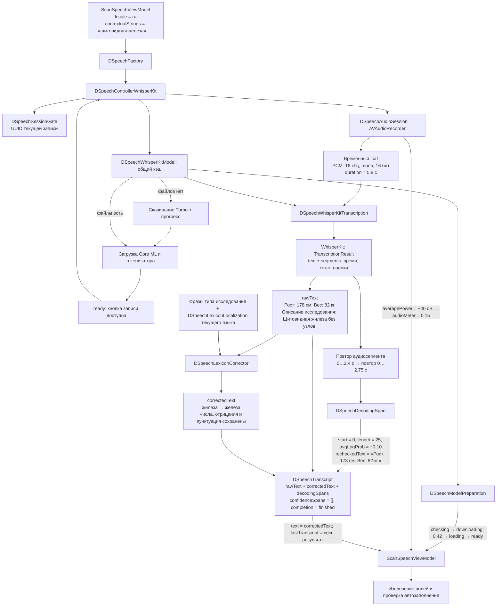
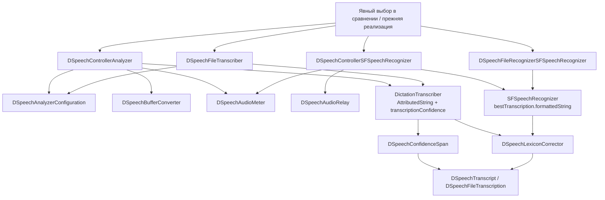

# DoglyadSpeech

Модуль отвечает за **запись и распознавание речи**. Его результат — текст с происхождением и признаками качества, а не заполненная форма. Извлечение полей находится в [DoglyadNeuralModel](../DoglyadNeuralModel/README.md), сохранение формы — в модуле `Scan`.

Все собственные типы модуля, включая вложенные вспомогательные типы, имеют префикс `DSpeech`.

## Структура папок

| Папка | Содержимое |
|---|---|
| `SpeechAnalyzer/` | Контроллер SpeechAnalyzer, конфигурация DictationTranscriber, распознавание файла и преобразователь PCM-буферов. |
| `SFSpeechRecognizer/` | Контроллер SFSpeechRecognizer, распознавание файла и передача аудиобуферов с сохранением хвоста между задачами. |
| `WhisperKit/` | Контроллер WhisperKit, подготовка модели и расшифровка с повторной проверкой сегментов. |
| `Span/` | `DSpeechConfidenceSpan` — confidence Apple Speech; `DSpeechDecodingSpan` — оценки Whisper и повторная расшифровка. Оба типа привязывают данные к UTF-16-диапазону исходного текста. |
| `Audio/` | Общая аудиосессия, измеритель уровня звука и словарная коррекция с её языковыми данными. |
| `Controller/` | Общий протокол контроллеров, защита сессии, результат и ошибки файлового Apple-распознавания. |
| Корень модуля | Фабрика, общие состояния, транскрипт, тип движка, завершение записи и общая ошибка. |

В папку движка попадают файлы, относящиеся только к нему. Общие типы не дублируются между реализациями.

## Текущий рабочий путь

`DSpeechFactory` всегда создаёт `DSpeechControllerWhisperKit`. SpeechAnalyzer и SFSpeechRecognizer сохранены для сравнений, автоматически вместо Whisper не выбираются.



1. При открытии шторки проверяется модель `large-v3-v20240930_626MB`. UI показывает проверку, скачивание или загрузку; запись доступна после `ready`.
2. При записи сохраняется моно PCM, 16 кГц, 16 бит. Текст Whisper появляется после остановки записи; текущий контроллер не делает потоковую расшифровку во время записи.
3. Полный файл распознаётся локально. Для записей длиннее 30 секунд используется VAD-разбиение.
4. Каждый сегмент повторно распознаётся. Стабильность и оценки декодера передаются приложению; совпадение двух расшифровок само по себе не доказывает медицинскую точность.
5. Словарная коррекция использует фразы выбранного типа исследования. Она сохраняет пунктуацию и пробелы, не меняет числа, отрицания, стороны и окончания слов. Эти ограничения получают словари только текущего языка.
6. `rawText` и `correctedText` хранятся отдельно. `ScanSpeech` решает, можно ли сразу разбирать результат или нужно показать незавершённую запись для проверки.
7. Временный файл удаляется после обработки. При отмене поздний результат не применяется; устаревшие файлы очищаются при следующем старте.

**Контекстные фразы сейчас используются для коррекции текста. В `promptTokens` декодера Whisper они не передаются.** Прежний эксперимент с прямой подсказкой ухудшал итоговую точность форм.

## Сквозной пример данных

Ниже один учебный пример для УЗИ щитовидной железы. Тексты показывают движение данных; длительность и оценки декодера условные и не являются результатом замера. Исправление `жилеза → железа` проверено на текущем `DSpeechLexiconCorrector` с RU-каталогом.

### 1. Подготовка и запись

| Откуда → куда | Вход | Что происходит / выход |
|---|---|---|
| Приложение → `DSpeechFactory` → `DSpeechControllerWhisperKit` | `locale = Locale(identifier: "ru")`; фразы исследования: `«щитовидная железа»`, `«щитовидная железа без узлов»`; RU-каталог `DSpeechLexiconLocalization` | Контроллер создаёт корректор с этими фразами. Язык распознавания Whisper будет `ru`. |
| `DSpeechWhisperKitModel` → контроллер → UI | Вариант `large-v3-v20240930_626MB`; путь к кэшу модели | Если файлов нет: `.checking → .downloading(progress: nil) → .downloading(progress: 0.42) → .loading → .ready`. `0.42` означает 42% скачивания. При готовом экземпляре сразу `.ready`. |
| `DSpeechAudioSession` → `AVAudioRecorder` | Аудиомаршрут, например `.builtIn` | Создаётся `<tmp>/doglyad-dictation-<UUID>.caf`: mono PCM, 16 кГц, 16 бит. Контроллер публикует `.recording`; текста Whisper во время записи ещё нет. |
| Metering `AVAudioRecorder` → UI | Например, `averagePower = −40 dB` | `pow(10, −40 / 20) × 15 = 0.15`: значение `audioMeter` для индикатора громкости. Это не оценка качества распознавания. |
| `stop()` → `DSpeechWhisperKitTranscription` | Путь `.caf`, `duration = 5.8`, `language = "ru"`, загруженный экземпляр `WhisperKit` | Запись останавливается, состояние становится `.transcribing`; файл целиком передаётся локальному ASR. Для длительности более 30 с включается VAD-разбиение. |

### 2. Аудио → исходный текст → диагностика

Whisper возвращает `TranscriptionResult.text` и аудиосегменты `TranscriptionSegment`. `DSpeechWhisperKitTranscription` объединяет тексты результатов пробелом, убирает пробелы по краям и получает:

```text
rawText = Рост: 178 см. Вес: 82 кг. Описание исследования: Щитовидная жилеза без узлов.
```

Пример сегментов одного результата:

| Сегмент | Время в аудио | `segment.text` после удаления служебных токенов | Диапазон в `rawText` |
|---|---|---|---|
| 1 | `0…2.4 с` | `Рост: 178 см. Вес: 82 кг.` | `utf16Start = 0`, `utf16Length = 25` |
| 2 | `2.4…5.8 с` | `Описание исследования: Щитовидная жилеза без узлов.` | `utf16Start = 26`, `utf16Length = 51` |

Границы сегментов определяет Whisper; они не обязаны совпадать с предложениями. Каждый сегмент повторно распознаётся с запасом 0,35 с по краям. Например, для сегмента 1 загружаются Float-аудиосэмплы интервала `0…2.75 с`, затем снова вызывается Whisper. Это повторное распознавание того же звука, а не проверка текста языковой моделью.

В первый `DSpeechDecodingSpan` попадают:

```swift
DSpeechDecodingSpan(
    utf16Start: 0,
    utf16Length: 25,
    averageLogProbability: -0.10,
    temperature: 0,
    compressionRatio: 1.10,
    recheckedText: "Рост: 178 см. Вес: 82 кг.",
)
```

| Свойство | Значение в примере | Смысл |
|---|---|---|
| `utf16Start`, `utf16Length` | `0`, `25` | Положение **в исходном `rawText`**, не секунды аудио. Для символов вне BMP один видимый символ может занимать две UTF-16-единицы. |
| `averageLogProbability` | `−0.10` | Средняя логарифмическая оценка выбранных токенов декодером; не процент точности. |
| `temperature` | `0` | Температура, с которой Whisper получил этот сегмент. |
| `compressionRatio` | `1.10` | Диагностическое отношение сжатия текста: используется для выявления подозрительных повторов. |
| `recheckedText` | `Рост: 178 см. Вес: 82 кг.` | Ответ повторного распознавания аудиофрагмента. Ошибка повторной проверки оставляет пустой ответ; ошибка сопоставления сегмента с текстом не создаёт span. |

### 3. Словарная коррекция → итоговый результат

```text
DSpeechLexiconCorrector получает rawText:
Рост: 178 см. Вес: 82 кг. Описание исследования: Щитовидная жилеза без узлов.

Возвращает correctedText:
Рост: 178 см. Вес: 82 кг. Описание исследования: Щитовидная железа без узлов.
```

Корректор сравнивает похожие по звучанию многословные фразы со словарём выбранного исследования. Здесь изменена только `жилеза`; `178`, `82`, `см`, `кг`, `без узлов` и пунктуация сохраняются. `rawText` не перезаписывается. Диагностика сегментов и повторная расшифровка тоже остаются привязанными к исходному тексту.

| Поле `DSpeechTranscript` | Что передаётся в этом примере |
|---|---|
| `rawText` | Исходная строка с `жилеза`. |
| `correctedText` | Строка с `железа`; если коррекции не было, совпадает с `rawText`. Это не текст после ручной правки врача. |
| `locale`, `engine` | `Locale(identifier: "ru")`, `.whisperKit`. |
| `completion` | `.finished`, если запись и расшифровка завершились штатно. |
| `confidenceSpans` | `[]`: Whisper-контроллер не заполняет оценки Apple Speech. |
| `decodingSpans` | Два `DSpeechDecodingSpan` из таблицы сегментов, с оценками Whisper и повторными текстами. |

Контроллер публикует `text = correctedText`, `lastTranscript = весь DSpeechTranscript` и `.stopped`. `isReadyForParsing` возвращает `true` только для `.finished` и непустого `correctedText`. Далее приложение передаёт строку в [DoglyadNeuralModel](../DoglyadNeuralModel/README.md#сквозной-пример-данных), а весь транскрипт сохраняет для последующей проверки автозаполнения. Изменённый корректором медицинский фрагмент не получает доверие только из-за высоких оценок исходного Whisper.

### 4. Прерывание и отмена

| Ситуация | Результат |
|---|---|
| Рекордер неожиданно остановился | Контроллер завершает запись с `.interrupted`; даже непустой текст сначала попадает в проверку/редактор приложения. |
| Запись не стартовала или основной Whisper-прогон завершился ошибкой | `.failed`, пустой `rawText`, пустые `decodingSpans`; автоматический разбор не начинается. |
| Проверка отдельного сегмента не удалась | Основной текст сохраняется, `recheckedText` этого сегмента пустой; затронутые поля не получают подтверждения стабильностью сегмента. |
| Пользователь отменил запись A, затем начал B | `DSpeechSessionGate` хранит UUID B; поздний `finish(A)` возвращает `false`. Результат A не становится `lastTranscript` и не заполняет форму. |

Временный файл удаляется при завершении обработки; отменённый ASR также проходит очистку. При следующем старте дополнительно удаляются оставшиеся записи старше часа.

## Типы и назначение

### Рабочая запись и Whisper

| Тип | Назначение |
|---|---|
| `DSpeechFactory` | Создаёт выбранный рабочий контроллер — WhisperKit. |
| `DSpeechControllerProtocol` | Общий наблюдаемый интерфейс: подготовка, старт, остановка, отмена, состояние и результат. |
| `DSpeechControllerWhisperKit` | Записывает файл, запускает локальную расшифровку, коррекцию и собирает результат. |
| `DSpeechWhisperKitModel` | Один экземпляр Whisper и одна задача подготовки; проверяет кэш, скачивает файлы, загружает модель, публикует прогресс. |
| `DSpeechWhisperKitTranscription` | Полная расшифровка и повтор сегментов; сопоставляет сегменты с UTF-16-позициями текста. |
| `DSpeechSessionGate` | Защищает от двойной финализации и поздних результатов отменённой/старой записи. |
| `DSpeechLexiconCorrector` | Консервативная коррекция похожих медицинских фраз по словарю выбранного исследования. |
| `DSpeechLexiconLocalization` | Отрицания, стороны и символьные соответствия выбранного языка; декодируется из ответа `/v1/l10n` и передаётся аргументом. |

### Состояния и результат

| Тип | Назначение |
|---|---|
| `DSpeechRecordingStatus` | Этап записи: подготовка, запись, распознавание, остановка. |
| `DSpeechModelPreparation` | Проверка модели, скачивание с прогрессом, загрузка, готовность либо ошибка. |
| `DSpeechTranscript` | Исходный/исправленный текст, локаль, движок, причина завершения и признаки качества. `isReadyForParsing` проверяет финальность и непустой текст. |
| `DSpeechEngine` | Происхождение текста: WhisperKit, SpeechAnalyzer, SFSpeechRecognizer. |
| `DSpeechCompletion` | Нормальное завершение, таймаут, прерывание, ошибка или отмена. |
| `DSpeechDecodingSpan` | UTF-16-диапазон Whisper, log probability, температура, compression ratio и повторная расшифровка. |
| `DSpeechConfidenceSpan` | UTF-16-диапазон и confidence Apple Speech; используется сохранёнными Apple-реализациями и тестами. |
| `DSpeechError` | Общая недоступность записи/распознавания. |

### Apple-реализации, сохранённые для сравнения

| Тип | Назначение / статус |
|---|---|
| `DSpeechControllerAnalyzer` | Прежняя потоковая запись и распознавание через SpeechAnalyzer/DictationTranscriber на iOS 26. Рабочая фабрика не выбирает. |
| `DSpeechAnalyzerConfiguration` | Общие настройки DictationTranscriber, контекст, установка языковых ресурсов. |
| `DSpeechControllerSFSpeechRecognizer` | Прежняя запись через SFSpeechRecognizer с ожиданием финального результата. Рабочая фабрика не выбирает. |
| `DSpeechFileTranscriber` | Прогон сохранённого аудиофайла через SpeechAnalyzer для сравнения ASR. |
| `DSpeechFileRecognizerSFSpeechRecognizer` | Прогон сохранённого файла через SFSpeechRecognizer для сравнения ASR. |
| `DSpeechFileTranscription` | Текст и confidence из файлового Apple-распознавания. |
| `DSpeechFileTranscriberError` | Диагностика несовместимого формата, недоступного языка, таймаута или сбоя файлового распознавания. |

### Аудиоинфраструктура

| Тип | Назначение / где используется |
|---|---|
| `DSpeechAudioSession` | Настраивает и освобождает AVAudioSession; используется Whisper и Apple-контроллерами. |
| `DSpeechAudioRoute` | Источник аудио (встроенный микрофон или гарнитура); используется при настройке аудиосессии и подсказках. |
| `DSpeechAudioRelay` | Передаёт микрофонные буферы в SFSpeechRecognizer; сохраняет и повторяет хвост аудио при смене задачи распознавания. |
| `DSpeechBufferConverter` | Приводит PCM-буфер к формату, совместимому с анализатором. |
| `DSpeechAudioMeter` | Потокобезопасная оценка уровня PCM-буфера для Apple-контроллеров. Whisper использует metering AVAudioRecorder. |



### Какие данные возвращают сохранённые Apple-реализации

| Реализация | Пример входа и промежуточных данных | Результат |
|---|---|---|
| `DSpeechControllerAnalyzer` | Микрофонные PCM-буферы → `DSpeechBufferConverter` → `AnalyzerInput` → `AttributedString`, например `Рост: 178 см. Вес: 82 кг.` с `transcriptionConfidence = 0.96` на диапазоне | `DSpeechConfidenceSpan(utf16Start: 0, utf16Length: 25, confidence: 0.96)`; `decodingSpans = []`. После общей коррекции собирается `DSpeechTranscript(engine: .speechAnalyzer, …)`. |
| `DSpeechControllerSFSpeechRecognizer` | PCM-буферы → `DSpeechAudioRelay` → `SFSpeechAudioBufferRecognitionRequest` → `bestTranscription.formattedString` | Исходный и исправленный текст в `DSpeechTranscript(engine: .sfSpeechRecognizer, …)`. **Текущая реализация оставляет оба массива spans пустыми**, хотя SDK отдельно предоставляет оценки сегментов. |
| `DSpeechFileTranscriber` / `DSpeechFileRecognizerSFSpeechRecognizer` | URL готового аудиофайла, локаль и фразы исследования | `DSpeechFileTranscription(rawText, correctedText, confidenceSpans)`: файловый SpeechAnalyzer добавляет spans из `AttributedString`, файловый SFSpeechRecognizer сейчас оставляет `confidenceSpans = []`. |

В отличие от `decodingSpans`, `confidenceSpans` содержат только диапазон исходного текста и оценку Apple в пределах `0…1`. `0.96` не означает гарантированные 96% медицинской точности. Рабочая фабрика не выбирает эти Apple-реализации вместо WhisperKit.

Вложенные `DSpeechLexiconCorrector.DSpeechLexiconTerm` и `.DSpeechLexiconSide` хранят подготовленную словарную фразу и её сторону. `DSpeechLexiconCodingKeys` задают технические JSON-имена.

## Почему результат содержит больше одной строки

Строка нужна для извлечения значений. Исходный текст и признаки сегментов нужны, чтобы не считать исправленную или нестабильную расшифровку доказательством для автоматического заполнения. Решение о подтверждении находится в `ScanSpeechConfidencePolicy`, а не в ASR-модуле.

Языковые данные находятся только на основном backend: `config/<environment>/<code>/l10n_voice_parsing.json`. Приложение скачивает `/v1/l10n` в Tier 4 для `Language.currentLocale`; `L10N.voice.speech` передаётся в модуль через аргументы и не ищет одновременно русские и английские слова.
